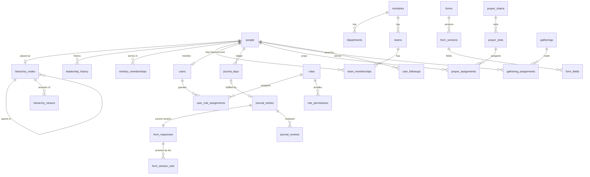

# Phase 3 — Database Architecture

> Part of the **Ministry System — Product & Architecture Blueprint**.
> This is the **logical model** written as PostgreSQL DDL for precision. In Phase 8 it becomes Drizzle schema files plus hand-written SQL migrations for the parts Drizzle can't express (exclusion constraints, the `immutable_unaccent` function, GIN `btree_gin` indexes). Tables are grouped by module. Creation order in real migrations follows FK dependencies.
> Tables marked **(V1)** are designed now so the MVP doesn't paint us into a corner, but are created later.

---

## 1. Conventions

| Topic | Decision | Reason |
|---|---|---|
| Primary keys | `uuid`, **UUIDv7**, generated by the application (or PG 18 `uuidv7()`) | Time-ordered (good B-tree locality), not enumerable, safe to show in portal URLs. Never used as a *secret* |
| Public identifiers | Separate: `person_code` (display), `entry_codes.code` (printed QR), hashed `action_tokens` / `participant_keys` (secrets) | Public URLs never reveal internal IDs or counts |
| Natural keys | Used where they *are* the identity: `journal_days (person_id, journal_date)`, `system_settings.key`, `permissions.key` | Enforces the business rule and makes partitioning possible |
| Enumerations | `text` + `CHECK` for fixed state machines; **lookup tables** for admin-configurable lists (serving roles, designations, leadership levels) | CHECK lists are easy to extend in a migration; lookup tables avoid code changes for ministry vocabulary |
| Time | Instants: `timestamptz` (UTC). Business dates: `date` computed in ministry/chain timezone. Local wall-clock templates: `time` + an IANA timezone | Correct across midnight, members abroad, and future DST ministries |
| Text | `citext` for emails; `pg_trgm` + `unaccent` for fuzzy, accent-insensitive name search | "Peña" is found by "pena"; typo-tolerant search |
| Audit columns | `created_at`, `updated_at` (maintained by the repository layer), `created_by` / `updated_by` where the actor matters | — |
| Deletion | Business entities are **archived** (`archived_at`) or **ended** (`ended_on`, `revoked_at`); hard delete only for derived data, drafts, expired secrets and retention purges | History and accountability; see §7 |
| FK behaviour | Default `RESTRICT` (NO ACTION). `CASCADE` only for owned children. No `SET NULL` on people/users (they are never hard-deleted) | Prevents silent data loss |

### Extensions & helper
```sql
CREATE EXTENSION IF NOT EXISTS citext;
CREATE EXTENSION IF NOT EXISTS pg_trgm;
CREATE EXTENSION IF NOT EXISTS unaccent;
CREATE EXTENSION IF NOT EXISTS btree_gist;   -- exclusion constraints mixing = and &&
CREATE EXTENSION IF NOT EXISTS btree_gin;    -- GIN index on (date, uuid[])

-- unaccent() is STABLE; generated columns and indexes need IMMUTABLE.
CREATE FUNCTION immutable_unaccent(text) RETURNS text
  LANGUAGE sql IMMUTABLE PARALLEL SAFE STRICT
  AS $$ SELECT public.unaccent('public.unaccent'::regdictionary, $1) $$;
```

---

## 2. Entity overview



**Module map**

| Module | Tables |
|---|---|
| Settings | `system_settings`, `leadership_levels`, `ministry_calendar_days`, `privacy_notice_versions` |
| People | `people`, `designation_types`, `person_designations`, `person_notes` (V1), `person_duplicate_candidates`, `person_merges` |
| Hierarchy | `hierarchy_nodes`, `hierarchy_closure`, `leadership_history`, `leader_change_requests` |
| Ministries | `ministries`, `departments`, `teams`, `ministry_memberships`, `team_memberships`, `team_member_serving_roles` |
| IAM | `users`, `auth_*` (Better Auth), `permissions`, `roles`, `role_permissions`, `user_role_assignments` |
| Forms | `forms`, `form_versions`, `form_fields`, `form_responses`, `form_answer_sets` |
| Journal | `journal_entries`, `journal_entry_revisions`, `journal_days`, `journal_reviews`, `journal_pauses`, `journal_leader_daily_summary` (V1) |
| Care | `care_followups` |
| Public access | `entry_codes`, `participant_keys`, `action_tokens`, `rate_limit_buckets` |
| Scheduling (shared) | `person_unavailability` |
| Prayer | `prayer_chains`, `prayer_chain_schedules`, `prayer_commitments`, `prayer_slots`, `prayer_assignments`, `prayer_assignment_events` |
| Devotional | `serving_roles`, `gathering_types`, `gathering_type_roles`, `gathering_schedules`, `gathering_schedule_teams`, `gatherings`, `gathering_assignments` |
| Notifications | `notification_templates`, `notification_preferences`, `push_subscriptions`, `notifications`, `notification_deliveries` |
| Audit | `audit_logs` |
| Import/Export | `import_jobs`, `import_rows`, `export_jobs` (V1) |

---

## 3. Hierarchy strategy (the most important design decision)

### Options compared
| Approach | Direct group | Whole branch | Ancestors | Move a sub-tree | Integrity | Fit |
|---|---|---|---|---|---|---|
| **Adjacency list only** (`parent_id`) + recursive CTE | ✅ trivial | ⚠️ recursion on every dashboard load; can't index "is in branch" | ⚠️ recursion | ✅ one row | ✅ FK | Fine at 2k people; wasteful at 50k with frequent branch rollups |
| **Materialised path** (`ltree` / text path) | ✅ | ✅ prefix/GiST | ✅ parse path | ⚠️ rewrite every descendant's path | ⚠️ path can drift from parent unless trigger-maintained | Strong option; `ltree` is poorly supported by TS ORMs; UUID labels make long paths |
| **Nested sets** | ✅ | ✅ range | ✅ | ❌ renumber large parts of the tree | ⚠️ fragile | Wrong for a tree that changes weekly |
| **Closure table** (`ancestor, descendant, depth`) | ✅ | ✅ one indexed join | ✅ one indexed lookup | ✅ delete/insert O(subtree × ancestors) rows | ✅ plain FKs, verifiable | **Best fit** |

### Recommendation: adjacency list (truth) + closure table (index) + snapshot on the ledger (history)

1. **`hierarchy_nodes.parent_person_id`** is the source of truth for the *current* tree (simple, FK-enforced, easy to reason about).
2. **`hierarchy_closure`** is a derived index of every ancestor/descendant pair, maintained **in the same transaction** by `HierarchyService` (not triggers, so the logic is testable TypeScript and bulk moves stay efficient). About 250k rows at 50k people. Verified nightly against a recursive CTE.
3. **`leadership_history`** records every change (who, when, why).
4. **`journal_days.hierarchy_path`** snapshots the ancestor chain *for that day*. Historical reports ("Primary Leader John's branch on 3 August") never need a historical closure table.

**Concurrency:** all hierarchy writes take `pg_advisory_xact_lock(<hierarchy lock id>)`. Hierarchy edits are rare (a few per day), so one global lock is negligible and removes every race (two admins moving related sub-trees simultaneously, cycle checks against stale data).

### Move algorithm (inside one transaction)
```sql
SELECT pg_advisory_xact_lock(7201);                        -- serialise hierarchy writes

-- 1. Cycle guard: the new leader must not be inside the moving sub-tree
SELECT 1 FROM hierarchy_closure
 WHERE ancestor_id = :node AND descendant_id = :new_parent;  -- any row → reject (CYCLE)

-- 2. Detach sub-tree from its old ancestors
DELETE FROM hierarchy_closure c
 USING hierarchy_closure sub, hierarchy_closure sup
 WHERE sub.ancestor_id = :node            AND c.descendant_id = sub.descendant_id
   AND sup.descendant_id = :node          AND sup.ancestor_id <> :node
   AND c.ancestor_id = sup.ancestor_id;

-- 3. Attach sub-tree under the new parent's ancestors (incl. the new parent)
INSERT INTO hierarchy_closure (ancestor_id, descendant_id, depth)
SELECT sup.ancestor_id, sub.descendant_id, sup.depth + sub.depth + 1
  FROM hierarchy_closure sup
  JOIN hierarchy_closure sub ON sub.ancestor_id = :node
 WHERE sup.descendant_id = :new_parent;

-- 4. Update adjacency, depth and primary leader for the moved sub-tree
UPDATE hierarchy_nodes SET parent_person_id = :new_parent, updated_at = now() WHERE person_id = :node;
UPDATE hierarchy_nodes n
   SET depth = d.max_depth, updated_at = now()
  FROM (SELECT descendant_id, max(depth) AS max_depth
          FROM hierarchy_closure
         WHERE descendant_id IN (SELECT descendant_id FROM hierarchy_closure WHERE ancestor_id = :node)
         GROUP BY descendant_id) d
 WHERE n.person_id = d.descendant_id;
-- primary_leader_person_id := ancestor whose depth = settings.primaryLeaderDepth (self if equal, NULL if shallower)

-- 5. leadership_history rows · re-snapshot unfinalised journal_days of the sub-tree · audit · enqueue notifications
```

### Key hierarchy queries
```sql
-- Direct group of a leader
SELECT p.* FROM hierarchy_nodes n JOIN people p ON p.id = n.person_id
 WHERE n.parent_person_id = :leader AND p.archived_at IS NULL;

-- Whole branch (excluding the leader)
SELECT p.* FROM hierarchy_closure c JOIN people p ON p.id = c.descendant_id
 WHERE c.ancestor_id = :leader AND c.depth > 0;

-- Chain of leadership above a person (nearest first)
SELECT p.*, c.depth FROM hierarchy_closure c JOIN people p ON p.id = c.ancestor_id
 WHERE c.descendant_id = :person AND c.depth > 0 ORDER BY c.depth;

-- Today's rollup per sub-leader under a Primary Leader ("Leader A: 11/12")
SELECT child.descendant_id AS sub_leader_id,
       count(*) FILTER (WHERE d.is_expected)                                     AS expected,
       count(*) FILTER (WHERE d.submission_status IN ('submitted','late'))       AS received,
       count(*) FILTER (WHERE d.submission_status = 'pending')                   AS not_yet
  FROM hierarchy_closure child
  JOIN hierarchy_closure sub ON sub.ancestor_id = child.descendant_id AND sub.depth > 0
  JOIN journal_days d        ON d.person_id = sub.descendant_id AND d.journal_date = :today
 WHERE child.ancestor_id = :primary AND child.depth = 1
 GROUP BY child.descendant_id;

-- Historical branch totals (uses the snapshot, not today's tree)
SELECT d.journal_date, count(*) FILTER (WHERE d.is_expected) AS expected,
       count(*) FILTER (WHERE d.submission_status IN ('submitted','late')) AS received
  FROM journal_days d
 WHERE d.journal_date BETWEEN :from AND :to
   AND d.hierarchy_path @> ARRAY[:primary]::uuid[]
 GROUP BY d.journal_date;
```

---

## 4. Complete initial model (DDL)

### 4.1 Settings & reference
```sql
CREATE TABLE system_settings (
  key         text PRIMARY KEY,                    -- 'journal.policy', 'ministry.profile', …
  value       jsonb NOT NULL,                      -- validated by a Zod schema per key
  updated_by  uuid REFERENCES users(id),
  updated_at  timestamptz NOT NULL DEFAULT now()
);

CREATE TABLE leadership_levels (
  id           uuid PRIMARY KEY,
  depth        smallint NOT NULL UNIQUE CHECK (depth >= 0),
  name         text NOT NULL,                      -- 'Primary Leader'
  plural_name  text NOT NULL,                      -- 'Primary Leaders'
  description  text,
  created_at   timestamptz NOT NULL DEFAULT now(),
  updated_at   timestamptz NOT NULL DEFAULT now()
);

CREATE TABLE ministry_calendar_days (
  day              date PRIMARY KEY,
  kind             text NOT NULL CHECK (kind IN ('journal_rest_day','holiday','special')),
  excuses_journal  boolean NOT NULL DEFAULT true,
  note             text,
  created_by       uuid REFERENCES users(id),
  created_at       timestamptz NOT NULL DEFAULT now()
);

CREATE TABLE privacy_notice_versions (
  version       text PRIMARY KEY,                  -- '2026-09-01'
  body_markdown text NOT NULL,
  published_at  timestamptz NOT NULL,
  published_by  uuid REFERENCES users(id)
);
```

**Settings keys (MVP):**
| Key | Shape (defaults) |
|---|---|
| `ministry.profile` | `{ name: 'Generation Touch Harvest International', shortName: 'GenTouch', tagline: "There's a Nation Inside of You!", logoAssetId?, timezone: 'Asia/Manila', defaultCountry: 'PH', locale: 'en-PH' }` |
| `people.fields` | `{ collectGender: false, collectAddress: false, collectBirthYear: false, ministryRequiredAtRegistration: false }` |
| `hierarchy` | `{ primaryLeaderDepth: 1, groupSizeSoftLimit: 12, leaderStatusDepth: 1 }` |
| `journal.policy` | `{ deadlineTime: '23:59', lateCutoffTime: '09:00', editWindow: 'until_deadline', contentVisibilityDepth: 1, missedStreakThreshold: 3, reviewExpected: true, showStreaksToLeaders: true }` |
| `journal.reminders` | `{ enabled: false, times: ['19:00'], channels: ['push','email'] }` |
| `prayer.defaults` | `{ graceMinutes: 15, checkinOpensMinutes: 15 }` |
| `public.identification` | `{ phoneMatchEnabled: true, otpEnabled: false, turnstileMode: 'risk_based' }` |
| `privacy` | `{ noticeVersion, minorsParticipate: true, adultAge: 18, retention: { journalContentYears: 3, prayerReportYears: 2, auditYears: 5, auditIpDays: 90 } }` |
| `notifications` | `{ smsDailyCap: 0, quietHours: { start: '21:00', end: '06:00' } }` |
| `features` | `{ [flag]: boolean }` |

### 4.2 People
```sql
CREATE TABLE people (
  id                     uuid PRIMARY KEY,
  person_code            text NOT NULL UNIQUE CHECK (person_code ~ '^P-[0-9A-HJKMNP-TV-Z]{6}$'),
  first_name             text NOT NULL CHECK (length(btrim(first_name)) BETWEEN 1 AND 80),
  middle_name            text,
  last_name              text NOT NULL CHECK (length(btrim(last_name)) BETWEEN 1 AND 80),
  suffix                 text,
  preferred_name         text,
  gender                 text CHECK (gender IN ('male','female')),        -- only if settings allow
  birth_month            smallint CHECK (birth_month BETWEEN 1 AND 12),
  birth_day              smallint CHECK (birth_day BETWEEN 1 AND 31),
  birth_year             smallint CHECK (birth_year BETWEEN 1900 AND 2100),
  phone_e164             text CHECK (phone_e164 ~ '^\+[1-9][0-9]{6,14}$'), -- NOT unique (shared phones)
  phone_verified_at      timestamptz,
  email                  citext,
  address_line           text,
  city                   text,
  province               text,
  country_code           char(2),
  status                 text NOT NULL DEFAULT 'active' CHECK (status IN ('active','inactive')),
  registration_status    text NOT NULL DEFAULT 'confirmed'
                           CHECK (registration_status IN ('unconfirmed','confirmed','rejected')),
  source                 text NOT NULL CHECK (source IN ('portal','import','public_registration')),
  joined_on              date,
  journal_expected       boolean NOT NULL DEFAULT true,
  consent_version        text REFERENCES privacy_notice_versions(version),
  consent_at             timestamptz,
  guardian_name          text,
  guardian_relationship  text,
  guardian_consent_at    timestamptz,
  merged_into_person_id  uuid REFERENCES people(id),
  archived_at            timestamptz,
  archived_reason        text CHECK (archived_reason IN ('left','moved','deceased','duplicate','anonymised','other')),
  search_name            text GENERATED ALWAYS AS (
                           lower(immutable_unaccent(
                             first_name || ' ' || coalesce(preferred_name, '') || ' ' ||
                             coalesce(middle_name, '') || ' ' || last_name))
                         ) STORED,
  created_at             timestamptz NOT NULL DEFAULT now(),
  updated_at             timestamptz NOT NULL DEFAULT now(),
  created_by             uuid REFERENCES users(id),
  updated_by             uuid REFERENCES users(id),
  CHECK ((archived_at IS NULL) = (archived_reason IS NULL)),
  CHECK (merged_into_person_id IS NULL OR (archived_reason = 'duplicate' AND merged_into_person_id <> id))
);
CREATE INDEX people_search_trgm ON people USING gin (search_name gin_trgm_ops);
CREATE INDEX people_phone       ON people (phone_e164) WHERE archived_at IS NULL;
CREATE INDEX people_email       ON people (email)      WHERE archived_at IS NULL;
CREATE INDEX people_sort_name   ON people (last_name, first_name, id) WHERE archived_at IS NULL;
CREATE INDEX people_unconfirmed ON people (created_at) WHERE registration_status = 'unconfirmed' AND archived_at IS NULL;

CREATE TABLE designation_types (                  -- configurable vocabulary
  key         text PRIMARY KEY,                    -- 'member','worker','pastor','staff'
  name        text NOT NULL,
  is_system   boolean NOT NULL DEFAULT false,
  sort_order  smallint NOT NULL DEFAULT 0
);

CREATE TABLE person_designations (
  id               uuid PRIMARY KEY,
  person_id        uuid NOT NULL REFERENCES people(id),
  designation_key  text NOT NULL REFERENCES designation_types(key) ON UPDATE CASCADE,
  started_on       date NOT NULL DEFAULT current_date,
  ended_on         date,
  created_at       timestamptz NOT NULL DEFAULT now(),
  CHECK (ended_on IS NULL OR ended_on >= started_on)
);
CREATE UNIQUE INDEX person_designation_active ON person_designations (person_id, designation_key) WHERE ended_on IS NULL;

CREATE TABLE person_notes (                       -- (V1)
  id              uuid PRIMARY KEY,
  person_id       uuid NOT NULL REFERENCES people(id),
  author_user_id  uuid NOT NULL REFERENCES users(id),
  visibility      text NOT NULL CHECK (visibility IN ('leadership','pastoral')),
  body            text NOT NULL,                   -- 'pastoral' bodies encrypted at application level (V1)
  key_version     smallint,                        -- encryption key version when encrypted
  created_at      timestamptz NOT NULL DEFAULT now(),
  updated_at      timestamptz NOT NULL DEFAULT now(),
  deleted_at      timestamptz
);
CREATE INDEX person_notes_person ON person_notes (person_id, created_at DESC) WHERE deleted_at IS NULL;

CREATE TABLE person_duplicate_candidates (
  id           uuid PRIMARY KEY,
  person_a_id  uuid NOT NULL REFERENCES people(id),
  person_b_id  uuid NOT NULL REFERENCES people(id),
  reasons      text[] NOT NULL,                   -- {'same_phone','similar_name','same_email'}
  score        numeric(4,3) NOT NULL CHECK (score BETWEEN 0 AND 1),
  status       text NOT NULL DEFAULT 'open' CHECK (status IN ('open','merged','not_duplicate')),
  reviewed_by  uuid REFERENCES users(id),
  reviewed_at  timestamptz,
  created_at   timestamptz NOT NULL DEFAULT now(),
  CHECK (person_a_id < person_b_id),              -- canonical ordering → one row per pair
  UNIQUE (person_a_id, person_b_id)
);
CREATE INDEX duplicate_open ON person_duplicate_candidates (created_at) WHERE status = 'open';

CREATE TABLE person_merges (
  id               uuid PRIMARY KEY,
  survivor_id      uuid NOT NULL REFERENCES people(id),
  merged_id        uuid NOT NULL UNIQUE REFERENCES people(id),
  merged_by        uuid NOT NULL REFERENCES users(id),
  merged_at        timestamptz NOT NULL DEFAULT now(),
  merged_snapshot  jsonb NOT NULL,                -- merged person's row + re-pointed record ids
  CHECK (survivor_id <> merged_id)
);
```

### 4.3 Leadership hierarchy
```sql
CREATE TABLE hierarchy_nodes (
  person_id                 uuid PRIMARY KEY REFERENCES people(id),
  parent_person_id          uuid REFERENCES hierarchy_nodes(person_id),        -- RESTRICT: can't remove a leader with a group
  depth                     smallint NOT NULL CHECK (depth >= 0),
  primary_leader_person_id  uuid REFERENCES hierarchy_nodes(person_id),        -- derived, maintained by service
  accepts_members           boolean NOT NULL DEFAULT false,                    -- appears in public leader selector
  placed_at                 timestamptz NOT NULL DEFAULT now(),
  updated_at                timestamptz NOT NULL DEFAULT now(),
  CHECK (parent_person_id IS NULL OR parent_person_id <> person_id),
  CHECK ((parent_person_id IS NULL) = (depth = 0))
);
CREATE INDEX hierarchy_children  ON hierarchy_nodes (parent_person_id);
CREATE INDEX hierarchy_primary   ON hierarchy_nodes (primary_leader_person_id);
CREATE INDEX hierarchy_acceptors ON hierarchy_nodes (person_id) WHERE accepts_members;

CREATE TABLE hierarchy_closure (
  ancestor_id    uuid NOT NULL REFERENCES hierarchy_nodes(person_id) ON DELETE CASCADE,
  descendant_id  uuid NOT NULL REFERENCES hierarchy_nodes(person_id) ON DELETE CASCADE,
  depth          smallint NOT NULL CHECK (depth >= 0),                          -- distance; 0 = self row
  PRIMARY KEY (ancestor_id, descendant_id),
  CHECK ((depth = 0) = (ancestor_id = descendant_id))
);
CREATE INDEX closure_by_descendant     ON hierarchy_closure (descendant_id, depth);
CREATE INDEX closure_by_ancestor_depth ON hierarchy_closure (ancestor_id, depth);

CREATE TABLE leader_change_requests (
  id                     uuid PRIMARY KEY,
  person_id              uuid NOT NULL REFERENCES people(id),
  from_leader_person_id  uuid REFERENCES people(id),
  to_leader_person_id    uuid NOT NULL REFERENCES people(id),
  source                 text NOT NULL CHECK (source IN ('public_form','portal','registration_correction')),
  requested_by_user_id   uuid REFERENCES users(id),          -- NULL when requested from the public form
  reason                 text,
  status                 text NOT NULL DEFAULT 'pending'
                           CHECK (status IN ('pending','approved','rejected','cancelled','superseded')),
  decided_by             uuid REFERENCES users(id),
  decided_at             timestamptz,
  decision_note          text,
  created_at             timestamptz NOT NULL DEFAULT now(),
  CHECK (to_leader_person_id <> person_id),
  CHECK ((status = 'pending') = (decided_at IS NULL))
);
CREATE UNIQUE INDEX leader_change_one_pending ON leader_change_requests (person_id) WHERE status = 'pending';
CREATE INDEX leader_change_inbox ON leader_change_requests (to_leader_person_id) WHERE status = 'pending';

CREATE TABLE leadership_history (                 -- append-only
  id                         uuid PRIMARY KEY,
  person_id                  uuid NOT NULL REFERENCES people(id),
  previous_leader_person_id  uuid REFERENCES people(id),
  new_leader_person_id       uuid REFERENCES people(id),
  change_type                text NOT NULL CHECK (change_type IN ('placed','moved','removed','group_reassigned')),
  moved_with_subtree         boolean NOT NULL DEFAULT false,
  effective_at               timestamptz NOT NULL DEFAULT now(),
  reason                     text,
  request_id                 uuid REFERENCES leader_change_requests(id),
  operation_id               uuid NOT NULL,       -- groups the rows of one bulk operation
  changed_by                 uuid REFERENCES users(id)   -- NULL = system
);
CREATE INDEX leadership_history_person ON leadership_history (person_id, effective_at DESC);
CREATE INDEX leadership_history_leader ON leadership_history (new_leader_person_id, effective_at DESC);
```

### 4.4 Ministries, departments, teams
```sql
CREATE TABLE ministries (
  id           uuid PRIMARY KEY,
  name         text NOT NULL,
  code         text NOT NULL UNIQUE,
  description  text,
  archived_at  timestamptz,
  created_at   timestamptz NOT NULL DEFAULT now(),
  updated_at   timestamptz NOT NULL DEFAULT now()
);
CREATE UNIQUE INDEX ministries_name_active ON ministries (lower(name)) WHERE archived_at IS NULL;

CREATE TABLE departments (
  id           uuid PRIMARY KEY,
  ministry_id  uuid NOT NULL REFERENCES ministries(id),
  name         text NOT NULL,
  archived_at  timestamptz,
  created_at   timestamptz NOT NULL DEFAULT now(),
  updated_at   timestamptz NOT NULL DEFAULT now(),
  UNIQUE (id, ministry_id)                      -- target for composite FKs below
);
CREATE UNIQUE INDEX departments_name_active ON departments (ministry_id, lower(name)) WHERE archived_at IS NULL;

CREATE TABLE teams (
  id              uuid PRIMARY KEY,
  ministry_id     uuid NOT NULL REFERENCES ministries(id),
  department_id   uuid,
  name            text NOT NULL,
  team_type       text NOT NULL DEFAULT 'general'
                    CHECK (team_type IN ('general','worship','prayer','production','hospitality')),
  lead_person_id  uuid REFERENCES people(id),
  archived_at     timestamptz,
  created_at      timestamptz NOT NULL DEFAULT now(),
  updated_at      timestamptz NOT NULL DEFAULT now(),
  FOREIGN KEY (department_id, ministry_id) REFERENCES departments (id, ministry_id)  -- dept must belong to same ministry
);
CREATE UNIQUE INDEX teams_name_active ON teams (ministry_id, lower(name)) WHERE archived_at IS NULL;

CREATE TABLE ministry_memberships (
  id             uuid PRIMARY KEY,
  person_id      uuid NOT NULL REFERENCES people(id),
  ministry_id    uuid NOT NULL REFERENCES ministries(id),
  department_id  uuid,
  position       text NOT NULL DEFAULT 'member' CHECK (position IN ('member','worker','assistant_head','head')),
  is_primary     boolean NOT NULL DEFAULT false,
  started_on     date NOT NULL DEFAULT current_date,
  ended_on       date,
  created_at     timestamptz NOT NULL DEFAULT now(),
  updated_at     timestamptz NOT NULL DEFAULT now(),
  FOREIGN KEY (department_id, ministry_id) REFERENCES departments (id, ministry_id),
  CHECK (ended_on IS NULL OR ended_on >= started_on)
);
CREATE UNIQUE INDEX ministry_membership_active  ON ministry_memberships (person_id, ministry_id) WHERE ended_on IS NULL;
CREATE UNIQUE INDEX ministry_membership_primary ON ministry_memberships (person_id) WHERE is_primary AND ended_on IS NULL;
CREATE INDEX ministry_membership_by_ministry    ON ministry_memberships (ministry_id, department_id) WHERE ended_on IS NULL;

CREATE TABLE team_memberships (
  id           uuid PRIMARY KEY,
  team_id      uuid NOT NULL REFERENCES teams(id),
  person_id    uuid NOT NULL REFERENCES people(id),
  member_role  text NOT NULL DEFAULT 'member' CHECK (member_role IN ('lead','assistant','member')),
  joined_on    date NOT NULL DEFAULT current_date,
  left_on      date,
  created_at   timestamptz NOT NULL DEFAULT now(),
  CHECK (left_on IS NULL OR left_on >= joined_on)
);
CREATE UNIQUE INDEX team_membership_active ON team_memberships (team_id, person_id) WHERE left_on IS NULL;
CREATE INDEX team_membership_person        ON team_memberships (person_id) WHERE left_on IS NULL;

CREATE TABLE team_member_serving_roles (          -- default roles a member plays (keyboard + backup vocal)
  team_membership_id  uuid NOT NULL REFERENCES team_memberships(id) ON DELETE CASCADE,
  serving_role_id     uuid NOT NULL REFERENCES serving_roles(id),
  is_primary          boolean NOT NULL DEFAULT false,
  PRIMARY KEY (team_membership_id, serving_role_id)
);
```

### 4.5 Identity & access (IAM)
```sql
CREATE TABLE users (
  id                  uuid PRIMARY KEY,
  person_id           uuid UNIQUE REFERENCES people(id),     -- NULL only for technical accounts
  email               citext NOT NULL UNIQUE,
  email_verified      boolean NOT NULL DEFAULT false,
  name                text NOT NULL,
  status              text NOT NULL DEFAULT 'invited' CHECK (status IN ('invited','active','suspended','deactivated')),
  two_factor_enabled  boolean NOT NULL DEFAULT false,
  last_login_at       timestamptz,
  created_at          timestamptz NOT NULL DEFAULT now(),
  updated_at          timestamptz NOT NULL DEFAULT now()
);
-- Better Auth-managed tables (mapped names; exact columns follow the library's schema).
-- Their primary keys are TEXT, not uuid: Better Auth supplies some ids itself
-- (verification rows are keyed by a hashed token). users.id stays uuid.
--   auth_sessions (id text, user_id → users CASCADE, token, expires_at, ip_address, user_agent,
--                  two_factor_verified_at timestamptz — NULL until the second factor passes)
--   auth_accounts (id text, user_id → users CASCADE, provider_id, account_id, password hash if enabled)
--   auth_verifications (id text, identifier, value, expires_at — magic-link tokens, stored hashed)
--   auth_passkeys (V1)

-- Second factor: our own table and service, NOT Better Auth's 2FA plugin
-- (its challenge does not cover magic-link sign-ins).
CREATE TABLE user_two_factors (
  user_id             uuid PRIMARY KEY REFERENCES users(id) ON DELETE CASCADE,
  secret_encrypted    text NOT NULL,                 -- AES-256-GCM
  confirmed_at        timestamptz,                   -- NULL while setup is pending
  backup_code_hashes  text[] NOT NULL DEFAULT '{}',  -- SHA-256, single use
  failed_attempts     integer NOT NULL DEFAULT 0 CHECK (failed_attempts >= 0),
  locked_until        timestamptz,                   -- 5 failures → 15 minutes
  last_used_step      bigint,                        -- replay protection
  created_at          timestamptz NOT NULL DEFAULT now(),
  updated_at          timestamptz NOT NULL DEFAULT now()
);

CREATE TABLE permissions (                         -- seeded from the code catalog; not user-editable
  key             text PRIMARY KEY,                -- 'journal.content.view'
  module          text NOT NULL,
  description     text NOT NULL,
  is_sensitive    boolean NOT NULL DEFAULT false,  -- requires 2FA; grants notify Pastors if pastoral
  is_pastoral     boolean NOT NULL DEFAULT false,
  allowed_scopes  text[] NOT NULL                  -- scope types this permission may be granted with
);

CREATE TABLE roles (
  id                  uuid PRIMARY KEY,
  key                 text NOT NULL UNIQUE,        -- 'super_admin','pastor','primary_leader','leader',…
  name                text NOT NULL,
  description         text,
  is_system           boolean NOT NULL DEFAULT false,
  default_scope_type  text NOT NULL CHECK (default_scope_type IN ('global','branch','ministry','team','prayer_chain','gathering_type')),
  default_branch_depth smallint CHECK (default_branch_depth > 0),
  archived_at         timestamptz,
  created_at          timestamptz NOT NULL DEFAULT now(),
  updated_at          timestamptz NOT NULL DEFAULT now()
);

CREATE TABLE role_permissions (
  role_id           uuid NOT NULL REFERENCES roles(id) ON DELETE CASCADE,
  permission_key    text NOT NULL REFERENCES permissions(key) ON UPDATE CASCADE,
  -- Branch grants: deepest level this permission reaches, whatever the assignment depth.
  -- E.g. a Primary Leader views the whole branch but edits only depth 1 ("V B · E D"). NULL = no cap.
  branch_depth_cap  smallint CHECK (branch_depth_cap IS NULL OR branch_depth_cap > 0),
  PRIMARY KEY (role_id, permission_key)
);

CREATE TABLE user_role_assignments (
  id                       uuid PRIMARY KEY,
  user_id                  uuid NOT NULL REFERENCES users(id),
  role_id                  uuid NOT NULL REFERENCES roles(id),
  scope_type               text NOT NULL CHECK (scope_type IN ('global','branch','ministry','team','prayer_chain','gathering_type')),
  scope_person_id          uuid REFERENCES people(id),                   -- branch anchor (usually the user's own person); placement checked at grant time
  scope_ministry_id        uuid REFERENCES ministries(id),
  scope_team_id            uuid REFERENCES teams(id),
  scope_prayer_chain_id    uuid REFERENCES prayer_chains(id),
  scope_gathering_type_id  uuid REFERENCES gathering_types(id),
  branch_max_depth         smallint CHECK (branch_max_depth > 0),       -- NULL = unlimited; 1 = direct group
  granted_by               uuid REFERENCES users(id),
  granted_at               timestamptz NOT NULL DEFAULT now(),
  expires_at               timestamptz,                                  -- e.g. break-glass, delegation
  grant_reason             text,
  revoked_at               timestamptz,
  revoked_by               uuid REFERENCES users(id),
  CHECK (num_nonnulls(scope_person_id, scope_ministry_id, scope_team_id, scope_prayer_chain_id, scope_gathering_type_id)
         = CASE WHEN scope_type = 'global' THEN 0 ELSE 1 END),
  CHECK (scope_type <> 'branch'         OR scope_person_id IS NOT NULL),
  CHECK (scope_type <> 'ministry'       OR scope_ministry_id IS NOT NULL),
  CHECK (scope_type <> 'team'           OR scope_team_id IS NOT NULL),
  CHECK (scope_type <> 'prayer_chain'   OR scope_prayer_chain_id IS NOT NULL),
  CHECK (scope_type <> 'gathering_type' OR scope_gathering_type_id IS NOT NULL),
  CHECK (branch_max_depth IS NULL OR scope_type = 'branch')
);
CREATE UNIQUE INDEX role_assignment_active ON user_role_assignments
  (user_id, role_id, scope_type,
   coalesce(scope_person_id, scope_ministry_id, scope_team_id, scope_prayer_chain_id, scope_gathering_type_id))
  NULLS NOT DISTINCT WHERE revoked_at IS NULL;
CREATE INDEX role_assignment_by_user ON user_role_assignments (user_id) WHERE revoked_at IS NULL;
```
Scopes use **one nullable FK column per scope type** (with `num_nonnulls` checks) instead of a polymorphic `scope_id`, so every scope reference is a real foreign key.

**Implementation notes (M0, 2026-09-14).** None of these change a concept. They record how the model was built:
- `scope_prayer_chain_id` and `scope_gathering_type_id` (and those scope types) are added by the M3/M4 migrations, when their tables exist.
- The active-assignment unique index coalesces the scope columns to the zero UUID instead of using `NULLS NOT DISTINCT`. It has the same effect: one active global assignment per user and role.
- `role_permissions.branch_depth_cap` was added so the matrix's view-branch versus edit-direct distinction can be expressed.
- Better Auth tables use text primary keys, and the second factor lives in `user_two_factors` (see above).

**Implementation notes (M1, 2026-09-14).**
- `user_role_assignments.scope_person_id` now references `people(id)` instead of `hierarchy_nodes` (migration `0002`). A revoked assignment must never block removing its anchor from the tree; whether the anchor is placed is checked when the role is granted.
- Correlated subqueries always use fully qualified outer columns (`src/server/db/sql-helpers.ts`). Drizzle omits table names in single-table queries, and an unqualified name inside a permission subquery can silently bind to the subquery's own table.

**Implementation notes (M2, 2026-09-15).** These come from migrations `0003_journal_foundation` and `0004_journal_constraints`.
- `participant_keys` adds `persistent` and `expires_at`, to tell a remembered device from a 2-hour session key. Key and token hashes are stored as hex `text`.
- `form_versions.retired_at` allows a submission on the previous version for 12 hours after new questions are published.
- `journal_pauses` uses `starts_on` and `ends_on` (NULL = until further notice) instead of a `daterange` column. A GiST exclusion constraint on the date range prevents overlapping active pauses.
- `journal_ledger_runs` records which days are opened, need re-sync, or are closed, so on-demand ledger maintenance is idempotent (see the docs/02 §7 note).
- `ministry_calendar_days` holds rest days, and `rate_limit_buckets` is `UNLOGGED`.
- A person who journals without being expected (for example, an unconfirmed registration) gets a ledger row with `is_expected = false`. Every entry therefore has exactly one day row.
- Follow-up dedupe keys:
  - `journal_streak:{personId}:{streakStart}`: one follow-up per missed-days streak, updated as the streak grows.
  - `journal_flag:{entryId}:{visibility}`: raised when a reviewer flags an entry.
- `leadership_history.request_id` references `leader_change_requests`; it is not an HTTP request id.

### 4.6 Forms engine (journal questions, prayer reports, future forms)
```sql
CREATE TABLE forms (
  id           uuid PRIMARY KEY,
  key          text NOT NULL UNIQUE,              -- 'daily_journal', 'prayer_report'
  name         text NOT NULL,
  purpose      text NOT NULL CHECK (purpose IN ('journal','prayer_report','general')),
  description  text,
  archived_at  timestamptz,
  created_at   timestamptz NOT NULL DEFAULT now(),
  updated_at   timestamptz NOT NULL DEFAULT now()
);

CREATE TABLE form_versions (
  id            uuid PRIMARY KEY,
  form_id       uuid NOT NULL REFERENCES forms(id),
  version_no    integer NOT NULL CHECK (version_no > 0),
  status        text NOT NULL DEFAULT 'draft' CHECK (status IN ('draft','published','retired')),
  published_at  timestamptz,
  published_by  uuid REFERENCES users(id),
  created_at    timestamptz NOT NULL DEFAULT now(),
  UNIQUE (form_id, version_no),
  CHECK ((status = 'draft') = (published_at IS NULL))
);
CREATE UNIQUE INDEX form_one_published ON form_versions (form_id) WHERE status = 'published';
CREATE UNIQUE INDEX form_one_draft     ON form_versions (form_id) WHERE status = 'draft';

CREATE TABLE form_fields (
  id               uuid PRIMARY KEY,
  form_version_id  uuid NOT NULL REFERENCES form_versions(id) ON DELETE CASCADE,  -- only drafts are deletable
  field_key        text NOT NULL CHECK (field_key ~ '^[a-z][a-z0-9_]{1,62}$'),   -- stable across versions
  field_type       text NOT NULL CHECK (field_type IN (
                     'short_text','long_text','yes_no','single_choice','multi_choice','number',
                     'scripture_ref','prayer_request','testimony','reflection','gratitude',
                     'date','time','datetime')),
  label            text NOT NULL,
  help_text        text,
  is_required      boolean NOT NULL DEFAULT false,
  sensitivity      text NOT NULL DEFAULT 'standard' CHECK (sensitivity IN ('standard','restricted','confidential')),
  config           jsonb NOT NULL DEFAULT '{}',   -- { options:[{key,label}], min, max, maxLength, placeholder }
  sort_order       smallint NOT NULL,
  UNIQUE (form_version_id, field_key),
  UNIQUE (form_version_id, sort_order) DEFERRABLE INITIALLY DEFERRED
);

CREATE TABLE form_responses (
  id               uuid PRIMARY KEY,
  form_version_id  uuid NOT NULL REFERENCES form_versions(id),        -- RESTRICT: published versions are immutable
  person_id        uuid REFERENCES people(id),                        -- NULL only for truly anonymous forms
  is_anonymous     boolean NOT NULL DEFAULT false,                    -- identity hidden from non-pastoral viewers
  submitted_at     timestamptz NOT NULL DEFAULT now()
);
CREATE INDEX form_responses_person ON form_responses (person_id, submitted_at DESC);

CREATE TABLE form_answer_sets (                     -- one row per sensitivity tier present in the response
  response_id  uuid NOT NULL REFERENCES form_responses(id) ON DELETE CASCADE,
  sensitivity  text NOT NULL CHECK (sensitivity IN ('standard','restricted','confidential')),
  answers      jsonb NOT NULL,                     -- { "<field_key>": AnswerValue, … } validated against form_fields
  key_version  smallint,                           -- V1: 'confidential' sets encrypted at application level
  PRIMARY KEY (response_id, sensitivity)
);
```

**Why answers are stored by sensitivity tier rather than one row per answer.** The permission boundary *is* the tier: a leader's query loads `standard` (+ `restricted` for the direct leader), and a pastor loads all three. RLS (V1) and field-level encryption (V1) apply to whole rows. It also keeps volume at about 1–2 rows per entry instead of 6–10. Per-question analytics ("how many answered *yes* to *Read the Bible today?*") remain simple JSONB queries. **Toggling a question on or off** means editing the draft copy and publishing a new version. Old entries keep their version, so history is never corrupted.

**Answer value shapes** (validated by Zod before insert): `{t:'text',v}`, `{t:'bool',v}`, `{t:'choice',v:key}`, `{t:'choices',v:[keys]}`, `{t:'number',v}`, `{t:'scripture',v:{book,chapter,verseStart?,verseEnd?,raw}}`, `{t:'date'|'time'|'datetime',v:ISO}`.

### 4.7 Daily journal
```sql
CREATE TABLE journal_entries (
  id                  uuid PRIMARY KEY,
  person_id           uuid NOT NULL REFERENCES people(id),
  journal_date        date NOT NULL,
  form_response_id    uuid NOT NULL UNIQUE REFERENCES form_responses(id),   -- current revision
  first_submitted_at  timestamptz NOT NULL,
  last_submitted_at   timestamptz NOT NULL,
  revision_no         smallint NOT NULL DEFAULT 1 CHECK (revision_no >= 1),
  timing              text NOT NULL CHECK (timing IN ('on_time','late')),
  channel             text NOT NULL CHECK (channel IN ('device_key','personal_link','phone_match','otp','proxy')),
  entry_code_id       uuid REFERENCES entry_codes(id),                       -- which QR it came through
  proxy_user_id       uuid REFERENCES users(id),
  content_purged_at   timestamptz,                                           -- retention purge marker
  created_at          timestamptz NOT NULL DEFAULT now(),
  UNIQUE (person_id, journal_date),                                          -- BR-J-04
  CHECK ((channel = 'proxy') = (proxy_user_id IS NOT NULL))
);

CREATE TABLE journal_entry_revisions (             -- every revision, including #1
  entry_id          uuid NOT NULL REFERENCES journal_entries(id),
  revision_no       smallint NOT NULL,
  form_response_id  uuid NOT NULL UNIQUE REFERENCES form_responses(id),
  idempotency_key   uuid NOT NULL UNIQUE,          -- replays return the original result
  submitted_at      timestamptz NOT NULL,
  PRIMARY KEY (entry_id, revision_no)
);

-- The accountability ledger: one narrow row per expected person per day. NO content here.
CREATE TABLE journal_days (
  person_id                 uuid NOT NULL REFERENCES people(id),
  journal_date              date NOT NULL,
  is_expected               boolean NOT NULL,
  submission_status         text NOT NULL CHECK (submission_status IN ('pending','submitted','late','missed','excused')),
  review_status             text NOT NULL DEFAULT 'none' CHECK (review_status IN ('none','awaiting','reviewed')),
  care_status               text NOT NULL DEFAULT 'none' CHECK (care_status IN ('none','needs_follow_up','resolved')),
  entry_id                  uuid UNIQUE REFERENCES journal_entries(id),
  excuse_reason             text CHECK (excuse_reason IN ('rest_day','pause','leader_excused','admin_excused')),
  leader_person_id          uuid REFERENCES people(id),          -- snapshot: direct leader that day
  primary_leader_person_id  uuid REFERENCES people(id),          -- snapshot
  hierarchy_path            uuid[] NOT NULL DEFAULT '{}',        -- snapshot: ancestors, root → direct leader
  finalized_at              timestamptz,
  created_at                timestamptz NOT NULL DEFAULT now(),
  updated_at                timestamptz NOT NULL DEFAULT now(),
  PRIMARY KEY (person_id, journal_date),
  CHECK ((submission_status IN ('submitted','late')) = (entry_id IS NOT NULL)),
  CHECK ((submission_status = 'excused') = (excuse_reason IS NOT NULL)),
  CHECK (submission_status <> 'pending' OR finalized_at IS NULL),
  CHECK (submission_status <> 'missed'  OR finalized_at IS NOT NULL),
  CHECK (is_expected OR submission_status IN ('submitted','late','excused')),
  CHECK (review_status = 'none' OR entry_id IS NOT NULL)
);
CREATE INDEX journal_days_by_leader ON journal_days (journal_date, leader_person_id)
  INCLUDE (submission_status, review_status, care_status, is_expected);
CREATE INDEX journal_days_branch    ON journal_days USING gin (journal_date, hierarchy_path);   -- btree_gin
CREATE INDEX journal_days_open      ON journal_days (journal_date) WHERE finalized_at IS NULL;
CREATE INDEX journal_days_awaiting  ON journal_days (leader_person_id, journal_date) WHERE review_status = 'awaiting';

CREATE TABLE journal_reviews (
  id                 uuid PRIMARY KEY,
  entry_id           uuid NOT NULL REFERENCES journal_entries(id),
  reviewer_user_id   uuid NOT NULL REFERENCES users(id),
  reviewed_at        timestamptz NOT NULL DEFAULT now(),
  comment            text,                          -- private leader note; same visibility as standard content
  share_with_person  boolean NOT NULL DEFAULT false, -- V1: encouragement delivered to the submitter
  flagged_follow_up  boolean NOT NULL DEFAULT false,
  UNIQUE (entry_id, reviewer_user_id)               -- one review per reviewer; edits update it
);

CREATE TABLE journal_pauses (
  id            uuid PRIMARY KEY,
  person_id     uuid NOT NULL REFERENCES people(id),
  during        daterange NOT NULL CHECK (NOT isempty(during)),
  reason        text NOT NULL CHECK (reason IN ('leave','sickness','travel','bereavement','other')),
  note          text,
  created_by    uuid REFERENCES users(id),
  created_at    timestamptz NOT NULL DEFAULT now(),
  cancelled_at  timestamptz,
  EXCLUDE USING gist (person_id WITH =, during WITH &&) WHERE (cancelled_at IS NULL)
);

CREATE TABLE journal_leader_daily_summary (        -- (V1) rollup for multi-year trends
  journal_date      date NOT NULL,
  leader_person_id  uuid NOT NULL REFERENCES people(id),
  leader_path       uuid[] NOT NULL,              -- snapshot of the leader's ancestors
  expected          integer NOT NULL,
  on_time           integer NOT NULL,
  late              integer NOT NULL,
  missed            integer NOT NULL,
  excused           integer NOT NULL,
  reviewed          integer NOT NULL,
  PRIMARY KEY (journal_date, leader_person_id)
);
```

**Ledger lifecycle:** `open_day` inserts `pending` (or `excused`) rows → submission flips to `submitted`/`late` and review to `awaiting` → review flips to `reviewed` → `close_day` turns remaining `pending` into `missed` and sets `finalized_at`. People who aren't expected but submit anyway get a row with `is_expected = false`. Completion % = received ÷ `is_expected`.

### 4.8 Care follow-ups (generic, reused by future modules)
```sql
CREATE TABLE care_followups (
  id                     uuid PRIMARY KEY,
  person_id              uuid NOT NULL REFERENCES people(id),     -- who this is about
  kind                   text NOT NULL CHECK (kind IN ('journal_missed_streak','journal_flagged','prayer_unconfirmed',
                             'serving_declined','registration_review','general')),
  source_type            text,                                     -- 'journal_day','journal_entry','prayer_assignment',…
  source_ref             text,                                     -- id / composite key (deliberately polymorphic)
  assigned_to_person_id  uuid REFERENCES people(id),               -- usually direct leader or coordinator
  status                 text NOT NULL DEFAULT 'open' CHECK (status IN ('open','in_progress','resolved','dismissed')),
  visibility             text NOT NULL DEFAULT 'leadership' CHECK (visibility IN ('leadership','pastoral')),
  summary                text NOT NULL,                            -- non-sensitive: "No journal for 3 days"
  resolution_note        text,                                     -- sensitive; permission-gated
  dedupe_key             text UNIQUE,                              -- 'journal_streak:{person}:{streak_start}'
  due_on                 date,
  created_by             uuid REFERENCES users(id),                -- NULL = system
  resolved_by            uuid REFERENCES users(id),
  resolved_at            timestamptz,
  created_at             timestamptz NOT NULL DEFAULT now(),
  updated_at             timestamptz NOT NULL DEFAULT now()
);
CREATE INDEX care_open_by_assignee ON care_followups (assigned_to_person_id, created_at DESC) WHERE status IN ('open','in_progress');
CREATE INDEX care_by_person        ON care_followups (person_id, created_at DESC);
```
`source_type/source_ref` is the **one deliberate polymorphic reference** in the model. Follow-ups will point at records from modules that don't exist yet, and the reference is informational (a link back), not structural.

### 4.9 Public access: entry codes, device keys, action tokens, rate limits
```sql
CREATE TABLE entry_codes (                          -- printed/shared, NOT secret, grants context only
  id                uuid PRIMARY KEY,
  code              text NOT NULL UNIQUE CHECK (code ~ '^[0-9A-HJKMNP-TV-Z]{8}$'),   -- Crockford base32
  kind              text NOT NULL CHECK (kind IN ('journal_general','journal_leader','prayer_chain')),
  leader_person_id  uuid REFERENCES people(id),
  prayer_chain_id   uuid REFERENCES prayer_chains(id),
  label             text,
  status            text NOT NULL DEFAULT 'active' CHECK (status IN ('active','retired')),
  retired_at        timestamptz,
  replaced_by_id    uuid REFERENCES entry_codes(id),
  scan_count        integer NOT NULL DEFAULT 0,
  last_scanned_at   timestamptz,
  created_by        uuid REFERENCES users(id),
  created_at        timestamptz NOT NULL DEFAULT now(),
  CHECK ((kind = 'journal_leader') = (leader_person_id IS NOT NULL)),
  CHECK ((kind = 'prayer_chain')   = (prayer_chain_id IS NOT NULL)),
  CHECK ((status = 'retired')      = (retired_at IS NOT NULL))
);
CREATE UNIQUE INDEX entry_code_active_leader  ON entry_codes (leader_person_id) WHERE status = 'active' AND kind = 'journal_leader';
CREATE UNIQUE INDEX entry_code_active_chain   ON entry_codes (prayer_chain_id)  WHERE status = 'active' AND kind = 'prayer_chain';
CREATE UNIQUE INDEX entry_code_active_general ON entry_codes (kind)             WHERE status = 'active' AND kind = 'journal_general';

CREATE TABLE participant_keys (                     -- "remember this phone"
  id              uuid PRIMARY KEY,
  person_id       uuid NOT NULL REFERENCES people(id),
  key_hash        bytea NOT NULL UNIQUE,            -- SHA-256 of a 256-bit random secret (cookie only)
  device_hint     text,                             -- coarse: 'Android · Chrome'
  created_via     text NOT NULL CHECK (created_via IN ('registration','phone_match','personal_link','otp')),
  created_at      timestamptz NOT NULL DEFAULT now(),
  last_used_at    timestamptz,
  revoked_at      timestamptz,
  revoked_reason  text
);
CREATE INDEX participant_keys_person ON participant_keys (person_id) WHERE revoked_at IS NULL;

CREATE TABLE action_tokens (                        -- secret, personal, single-purpose, expiring
  id                       uuid PRIMARY KEY,
  token_hash               bytea NOT NULL UNIQUE,
  purpose                  text NOT NULL CHECK (purpose IN ('personal_key_install','prayer_assignment','gathering_assignment')),
  person_id                uuid NOT NULL REFERENCES people(id),
  prayer_assignment_id     uuid REFERENCES prayer_assignments(id),
  gathering_assignment_id  uuid REFERENCES gathering_assignments(id),
  expires_at               timestamptz NOT NULL,
  max_uses                 smallint NOT NULL DEFAULT 20,
  use_count                smallint NOT NULL DEFAULT 0,
  last_used_at             timestamptz,
  revoked_at               timestamptz,
  created_by               uuid REFERENCES users(id),
  created_at               timestamptz NOT NULL DEFAULT now(),
  CHECK (num_nonnulls(prayer_assignment_id, gathering_assignment_id)
         = CASE WHEN purpose = 'personal_key_install' THEN 0 ELSE 1 END),
  CHECK (purpose <> 'prayer_assignment'    OR prayer_assignment_id IS NOT NULL),
  CHECK (purpose <> 'gathering_assignment' OR gathering_assignment_id IS NOT NULL),
  CHECK (use_count <= max_uses)
);
CREATE INDEX action_tokens_prayer    ON action_tokens (prayer_assignment_id)    WHERE revoked_at IS NULL;
CREATE INDEX action_tokens_gathering ON action_tokens (gathering_assignment_id) WHERE revoked_at IS NULL;
CREATE INDEX action_tokens_expiry    ON action_tokens (expires_at);

CREATE UNLOGGED TABLE rate_limit_buckets (          -- ephemeral; loss on crash is acceptable
  bucket_key    text NOT NULL,                      -- 'identify:phone:<HMAC>' — never raw phone/IP
  window_start  timestamptz NOT NULL,
  hits          integer NOT NULL DEFAULT 1,
  PRIMARY KEY (bucket_key, window_start)
);
```

### 4.10 Shared scheduling
```sql
CREATE TABLE person_unavailability (
  id          uuid PRIMARY KEY,
  person_id   uuid NOT NULL REFERENCES people(id),
  during      tstzrange NOT NULL CHECK (NOT isempty(during)),
  reason      text,
  source      text NOT NULL CHECK (source IN ('self','coordinator','admin')),
  created_by  uuid REFERENCES users(id),
  created_at  timestamptz NOT NULL DEFAULT now()
);
CREATE INDEX unavailability_lookup ON person_unavailability USING gist (person_id, during);
```

### 4.11 Prayer chain
```sql
CREATE TABLE prayer_chains (
  id                     uuid PRIMARY KEY,
  name                   text NOT NULL,
  description            text,
  chain_type             text NOT NULL CHECK (chain_type IN ('continuous','scheduled_blocks','event')),
  timezone               text NOT NULL DEFAULT 'Asia/Manila',             -- IANA name, validated in app
  ministry_id            uuid REFERENCES ministries(id),
  status                 text NOT NULL DEFAULT 'draft' CHECK (status IN ('draft','active','paused','ended')),
  starts_on              date NOT NULL,
  ends_on                date,
  grace_minutes          smallint NOT NULL DEFAULT 15 CHECK (grace_minutes BETWEEN 0 AND 240),
  checkin_opens_minutes  smallint NOT NULL DEFAULT 15 CHECK (checkin_opens_minutes BETWEEN 0 AND 120),
  require_checkin        boolean NOT NULL DEFAULT false,
  show_names_publicly    boolean NOT NULL DEFAULT false,                  -- chain page shows first names
  report_form_id         uuid REFERENCES forms(id),
  archived_at            timestamptz,
  created_by             uuid REFERENCES users(id),
  created_at             timestamptz NOT NULL DEFAULT now(),
  updated_at             timestamptz NOT NULL DEFAULT now(),
  CHECK (ends_on IS NULL OR ends_on >= starts_on)
);

CREATE TABLE prayer_chain_schedules (
  id                    uuid PRIMARY KEY,
  prayer_chain_id       uuid NOT NULL REFERENCES prayer_chains(id),
  rrule                 text NOT NULL,              -- RFC 5545, e.g. 'FREQ=DAILY'
  first_slot_time       time NOT NULL,              -- local wall-clock time of first slot per occurrence
  slot_minutes          smallint NOT NULL CHECK (slot_minutes BETWEEN 5 AND 1440),
  slots_per_occurrence  smallint NOT NULL CHECK (slots_per_occurrence BETWEEN 1 AND 288),
  capacity              smallint NOT NULL DEFAULT 1 CHECK (capacity BETWEEN 1 AND 50),
  effective_from        date NOT NULL,
  effective_to          date,
  generate_days_ahead   smallint NOT NULL DEFAULT 14 CHECK (generate_days_ahead BETWEEN 1 AND 90),
  created_at            timestamptz NOT NULL DEFAULT now(),
  updated_at            timestamptz NOT NULL DEFAULT now()
);

CREATE TABLE prayer_commitments (                   -- "Mary prays every Tuesday 2–3 AM"
  id                uuid PRIMARY KEY,
  prayer_chain_id   uuid NOT NULL REFERENCES prayer_chains(id),
  person_id         uuid NOT NULL REFERENCES people(id),
  rrule             text NOT NULL,                  -- 'FREQ=WEEKLY;BYDAY=TU'
  local_start_time  time NOT NULL,
  effective_from    date NOT NULL,
  effective_to      date,
  created_by        uuid REFERENCES users(id),
  created_at        timestamptz NOT NULL DEFAULT now(),
  ended_at          timestamptz
);
CREATE INDEX prayer_commitments_active ON prayer_commitments (prayer_chain_id) WHERE ended_at IS NULL;

CREATE TABLE prayer_slots (
  id               uuid PRIMARY KEY,
  prayer_chain_id  uuid NOT NULL REFERENCES prayer_chains(id),
  schedule_id      uuid REFERENCES prayer_chain_schedules(id),     -- NULL for one-off slots
  chain_date       date NOT NULL,                                  -- local date of starts_at (BR-PR-06)
  starts_at        timestamptz NOT NULL,
  ends_at          timestamptz NOT NULL,
  capacity         smallint NOT NULL DEFAULT 1 CHECK (capacity >= 1),
  status           text NOT NULL DEFAULT 'open' CHECK (status IN ('open','cancelled')),
  note             text,
  created_at       timestamptz NOT NULL DEFAULT now(),
  CHECK (ends_at > starts_at),
  UNIQUE (prayer_chain_id, starts_at),                             -- idempotent generation
  EXCLUDE USING gist (prayer_chain_id WITH =, tstzrange(starts_at, ends_at) WITH &&) WHERE (status = 'open')
);
CREATE INDEX prayer_slots_board   ON prayer_slots (prayer_chain_id, chain_date, starts_at);
CREATE INDEX prayer_slots_ending  ON prayer_slots (ends_at) WHERE status = 'open';

CREATE TABLE prayer_assignments (
  id                  uuid PRIMARY KEY,
  slot_id             uuid NOT NULL REFERENCES prayer_slots(id),
  person_id           uuid NOT NULL REFERENCES people(id),
  slot_period         tstzrange NOT NULL,           -- copy of slot times (enables the overlap constraint)
  status              text NOT NULL DEFAULT 'scheduled' CHECK (status IN (
                        'scheduled','confirmed','in_prayer','completed','needs_follow_up',
                        'missed','excused','replaced','cancelled')),
  completed_late      boolean NOT NULL DEFAULT false,
  verified_by_coordinator boolean NOT NULL DEFAULT false,
  source              text NOT NULL CHECK (source IN ('commitment','manual','substitute','self_signup')),
  commitment_id       uuid REFERENCES prayer_commitments(id),
  substitute_for_id   uuid REFERENCES prayer_assignments(id),
  confirmed_at        timestamptz,
  checked_in_at       timestamptz,
  completed_at        timestamptz,
  resolved_by         uuid REFERENCES users(id),     -- coordinator decisions (missed / excused / verified)
  resolved_at         timestamptz,
  report_response_id  uuid REFERENCES form_responses(id),
  note                text,
  created_by          uuid REFERENCES users(id),
  created_at          timestamptz NOT NULL DEFAULT now(),
  updated_at          timestamptz NOT NULL DEFAULT now(),
  CHECK (substitute_for_id IS NULL OR substitute_for_id <> id),
  CHECK (status NOT IN ('missed','excused') OR resolved_by IS NOT NULL),     -- only humans decide these
  EXCLUDE USING gist (person_id WITH =, slot_period WITH &&)
    WHERE (status NOT IN ('replaced','cancelled','excused'))                -- BR-PR-01
);
CREATE UNIQUE INDEX prayer_assignment_active ON prayer_assignments (slot_id, person_id) WHERE status NOT IN ('replaced','cancelled');
CREATE INDEX prayer_assignments_slot      ON prayer_assignments (slot_id);
CREATE INDEX prayer_assignments_followup  ON prayer_assignments (updated_at) WHERE status = 'needs_follow_up';

CREATE TABLE prayer_assignment_events (             -- append-only timeline
  id             uuid PRIMARY KEY,
  assignment_id  uuid NOT NULL REFERENCES prayer_assignments(id),
  event_type     text NOT NULL CHECK (event_type IN ('assigned','confirmed','checked_in','completed','cannot_make_it',
                   'substitute_assigned','flagged_follow_up','resolved_missed','resolved_excused',
                   'resolved_completed','cancelled','reopened')),
  occurred_at    timestamptz NOT NULL DEFAULT now(),
  actor_type     text NOT NULL CHECK (actor_type IN ('participant','user','system')),
  actor_user_id  uuid REFERENCES users(id),
  via            text CHECK (via IN ('action_link','chain_page','portal','job')),
  note           text
);
CREATE INDEX prayer_events_by_assignment ON prayer_assignment_events (assignment_id, occurred_at);
```
*Upcoming* is derived (`scheduled`/`confirmed` and `starts_at > now()`), never stored, so it can't go stale.

### 4.12 Morning devotional / worship
```sql
CREATE TABLE serving_roles (                         -- configurable vocabulary
  id          uuid PRIMARY KEY,
  key         text NOT NULL UNIQUE,                  -- 'worship_leader','keyboard','prayer_leader',…
  name        text NOT NULL,
  category    text NOT NULL CHECK (category IN ('music','word','prayer','production','hosting','other')),
  sort_order  smallint NOT NULL DEFAULT 0,
  is_active   boolean NOT NULL DEFAULT true
);

CREATE TABLE gathering_types (
  id                        uuid PRIMARY KEY,
  key                       text NOT NULL UNIQUE,    -- 'morning_devotional'
  name                      text NOT NULL,
  default_start_time        time NOT NULL,
  default_duration_minutes  smallint NOT NULL CHECK (default_duration_minutes BETWEEN 5 AND 600),
  ministry_id               uuid REFERENCES ministries(id),
  response_lock_hours       smallint NOT NULL DEFAULT 12,   -- after this, changes go through the coordinator
  is_active                 boolean NOT NULL DEFAULT true,
  created_at                timestamptz NOT NULL DEFAULT now()
);

CREATE TABLE gathering_type_roles (                  -- roster template: required roles and counts
  gathering_type_id  uuid NOT NULL REFERENCES gathering_types(id) ON DELETE CASCADE,
  serving_role_id    uuid NOT NULL REFERENCES serving_roles(id),
  min_count          smallint NOT NULL DEFAULT 1 CHECK (min_count >= 0),
  max_count          smallint NOT NULL DEFAULT 1,
  sort_order         smallint NOT NULL DEFAULT 0,
  PRIMARY KEY (gathering_type_id, serving_role_id),
  CHECK (max_count >= greatest(min_count, 1))
);

CREATE TABLE gathering_schedules (
  id                   uuid PRIMARY KEY,
  gathering_type_id    uuid NOT NULL REFERENCES gathering_types(id),
  name                 text NOT NULL,
  rrule                text NOT NULL,              -- 'FREQ=WEEKLY;BYDAY=MO,TU,WE,TH,FR,SA'
  start_time           time NOT NULL,
  duration_minutes     smallint NOT NULL,
  effective_from       date NOT NULL,
  effective_to         date,
  rotation_mode        text NOT NULL DEFAULT 'none' CHECK (rotation_mode IN ('none','per_occurrence','weekly')),
  rotation_anchor      date,                        -- occurrence/week that maps to rotation position 0
  generate_days_ahead  smallint NOT NULL DEFAULT 56 CHECK (generate_days_ahead BETWEEN 1 AND 180),
  is_active            boolean NOT NULL DEFAULT true,
  created_at           timestamptz NOT NULL DEFAULT now(),
  updated_at           timestamptz NOT NULL DEFAULT now(),
  CHECK (rotation_mode = 'none' OR rotation_anchor IS NOT NULL)
);

CREATE TABLE gathering_schedule_teams (              -- rotation order: A → B → C
  schedule_id  uuid NOT NULL REFERENCES gathering_schedules(id) ON DELETE CASCADE,
  position     smallint NOT NULL CHECK (position >= 0),
  team_id      uuid NOT NULL REFERENCES teams(id),
  PRIMARY KEY (schedule_id, position)
);

CREATE TABLE gatherings (                            -- one concrete occurrence
  id                   uuid PRIMARY KEY,
  gathering_type_id    uuid NOT NULL REFERENCES gathering_types(id),
  schedule_id          uuid REFERENCES gathering_schedules(id),
  occurs_on            date NOT NULL,
  starts_at            timestamptz NOT NULL,
  ends_at              timestamptz NOT NULL,
  team_id              uuid REFERENCES teams(id),
  title                text,
  status               text NOT NULL DEFAULT 'scheduled' CHECK (status IN ('scheduled','cancelled','completed')),
  roster_published_at  timestamptz,
  cancel_reason        text,
  notes                text,
  created_at           timestamptz NOT NULL DEFAULT now(),
  updated_at           timestamptz NOT NULL DEFAULT now(),
  CHECK (ends_at > starts_at),
  CHECK ((status = 'cancelled') = (cancel_reason IS NOT NULL))
);
CREATE UNIQUE INDEX gatherings_generated ON gatherings (schedule_id, occurs_on) WHERE schedule_id IS NOT NULL;   -- BR-D-03
CREATE INDEX gatherings_by_date ON gatherings (occurs_on, gathering_type_id);

CREATE TABLE gathering_assignments (
  id                 uuid PRIMARY KEY,
  gathering_id       uuid NOT NULL REFERENCES gatherings(id),
  serving_role_id    uuid NOT NULL REFERENCES serving_roles(id),
  person_id          uuid NOT NULL REFERENCES people(id),
  status             text NOT NULL DEFAULT 'pending' CHECK (status IN ('pending','confirmed','declined','replaced','cancelled')),
  source             text NOT NULL CHECK (source IN ('rotation','manual','substitute')),
  substitute_for_id  uuid REFERENCES gathering_assignments(id),
  responded_at       timestamptz,
  response_note      text,
  notified_at        timestamptz,
  assigned_by        uuid REFERENCES users(id),
  created_at         timestamptz NOT NULL DEFAULT now(),
  updated_at         timestamptz NOT NULL DEFAULT now(),
  CHECK (substitute_for_id IS NULL OR substitute_for_id <> id)
);
CREATE UNIQUE INDEX gathering_assignment_active ON gathering_assignments (gathering_id, serving_role_id, person_id)
  WHERE status IN ('pending','confirmed');                                                                        -- BR-D-01
CREATE INDEX gathering_assignments_person  ON gathering_assignments (person_id, created_at DESC);
CREATE INDEX gathering_assignments_pending ON gathering_assignments (gathering_id) WHERE status = 'pending';
```

### 4.13 Notifications
```sql
CREATE TABLE notification_templates (
  id          uuid PRIMARY KEY,
  key         text NOT NULL,                        -- 'journal.reminder'
  channel     text NOT NULL CHECK (channel IN ('in_app','email','sms','push','viber','whatsapp','messenger')),
  locale      text NOT NULL DEFAULT 'en',
  version     integer NOT NULL CHECK (version > 0),
  subject     text,
  body        text NOT NULL,                        -- {{firstName}} {{link}}; escaped per channel
  is_active   boolean NOT NULL DEFAULT false,
  updated_by  uuid REFERENCES users(id),
  created_at  timestamptz NOT NULL DEFAULT now(),
  UNIQUE (key, channel, locale, version)
);
CREATE UNIQUE INDEX notification_template_active ON notification_templates (key, channel, locale) WHERE is_active;

CREATE TABLE notification_preferences (
  person_id   uuid NOT NULL REFERENCES people(id),
  category    text NOT NULL,                        -- 'journal_reminder','prayer_reminder','serving','leader_digest'
  channel     text NOT NULL,
  enabled     boolean NOT NULL,
  updated_at  timestamptz NOT NULL DEFAULT now(),
  PRIMARY KEY (person_id, category, channel)
);

CREATE TABLE push_subscriptions (
  id                  uuid PRIMARY KEY,
  person_id           uuid REFERENCES people(id),
  user_id             uuid REFERENCES users(id),
  participant_key_id  uuid REFERENCES participant_keys(id) ON DELETE CASCADE,
  endpoint            text NOT NULL UNIQUE,
  p256dh              text NOT NULL,
  auth_secret         text NOT NULL,
  created_at          timestamptz NOT NULL DEFAULT now(),
  last_success_at     timestamptz,
  revoked_at          timestamptz,
  CHECK (person_id IS NOT NULL OR user_id IS NOT NULL)
);

CREATE TABLE notifications (                        -- the intent; one per logical message
  id                   uuid PRIMARY KEY,
  category             text NOT NULL,
  template_key         text NOT NULL,
  recipient_person_id  uuid REFERENCES people(id),
  recipient_user_id    uuid REFERENCES users(id),
  payload              jsonb NOT NULL DEFAULT '{}',  -- NEVER sensitive content
  dedupe_key           text NOT NULL UNIQUE,         -- idempotency
  scheduled_for        timestamptz NOT NULL DEFAULT now(),
  status               text NOT NULL DEFAULT 'pending' CHECK (status IN (
                         'pending','processing','sent','partially_sent','failed','suppressed','cancelled')),
  suppressed_reason    text,
  read_at              timestamptz,                  -- in-app
  created_at           timestamptz NOT NULL DEFAULT now(),
  CHECK (recipient_person_id IS NOT NULL OR recipient_user_id IS NOT NULL)
);
CREATE INDEX notifications_inbox ON notifications (recipient_user_id, created_at DESC) WHERE recipient_user_id IS NOT NULL;
CREATE INDEX notifications_due   ON notifications (scheduled_for) WHERE status = 'pending';

CREATE TABLE notification_deliveries (              -- one per channel attempt series
  id                   uuid PRIMARY KEY,
  notification_id      uuid NOT NULL REFERENCES notifications(id) ON DELETE CASCADE,
  channel              text NOT NULL,
  provider             text NOT NULL,
  destination_masked   text NOT NULL,              -- '+63917•••4521'
  status               text NOT NULL DEFAULT 'queued' CHECK (status IN ('queued','sent','delivered','failed','bounced')),
  provider_message_id  text,
  attempts             smallint NOT NULL DEFAULT 0,
  last_error           text,
  cost_units           numeric(10,4),
  sent_at              timestamptz,
  delivered_at         timestamptz,
  created_at           timestamptz NOT NULL DEFAULT now()
);
CREATE INDEX deliveries_by_provider_msg ON notification_deliveries (provider, provider_message_id);
CREATE INDEX deliveries_by_notification ON notification_deliveries (notification_id);
```

### 4.14 Audit
```sql
CREATE TABLE audit_logs (                           -- append-only (app role: INSERT only)
  id               bigint GENERATED ALWAYS AS IDENTITY PRIMARY KEY,   -- internal; never exposed
  occurred_at      timestamptz NOT NULL DEFAULT now(),
  category         text NOT NULL CHECK (category IN ('change','access','auth','security','system')),
  action           text NOT NULL,                  -- 'person.leader_changed','journal.content_viewed'
  actor_type       text NOT NULL CHECK (actor_type IN ('user','participant','system')),
  actor_user_id    uuid REFERENCES users(id),
  actor_person_id  uuid REFERENCES people(id),
  entity_type      text NOT NULL,
  entity_id        text NOT NULL,                  -- uuid or composite key ('person:date')
  summary          text,
  old_values       jsonb,                          -- redacted per field policy (never journal content)
  new_values       jsonb,
  reason           text,                           -- break-glass / sensitive-action justification
  request_id       uuid,
  ip               inet,                           -- nulled after 90 days
  user_agent       text                            -- nulled after 90 days
);
CREATE INDEX audit_by_entity ON audit_logs (entity_type, entity_id, occurred_at DESC);
CREATE INDEX audit_by_actor  ON audit_logs (actor_user_id, occurred_at DESC);
CREATE INDEX audit_by_time   ON audit_logs USING brin (occurred_at);
-- Enforcement: REVOKE UPDATE, DELETE ON audit_logs FROM app_rw; the retention job runs as a separate role.
```

### 4.15 Import & export
```sql
CREATE TABLE import_jobs (
  id            uuid PRIMARY KEY,
  kind          text NOT NULL CHECK (kind IN ('people_hierarchy')),
  status        text NOT NULL CHECK (status IN ('uploaded','validating','previewed','committing','completed','failed','cancelled')),
  file_name     text NOT NULL,
  options       jsonb NOT NULL DEFAULT '{}',
  stats         jsonb NOT NULL DEFAULT '{}',
  created_by    uuid NOT NULL REFERENCES users(id),
  created_at    timestamptz NOT NULL DEFAULT now(),
  completed_at  timestamptz
);

CREATE TABLE import_rows (                          -- raw PII: purged 30 days after completion
  import_job_id      uuid NOT NULL REFERENCES import_jobs(id) ON DELETE CASCADE,
  row_no             integer NOT NULL,
  raw                jsonb NOT NULL,
  normalized         jsonb,
  outcome            text NOT NULL CHECK (outcome IN ('valid','warning','error','duplicate_candidate','imported','skipped')),
  messages           jsonb NOT NULL DEFAULT '[]',
  matched_person_id  uuid REFERENCES people(id),
  created_person_id  uuid REFERENCES people(id),
  PRIMARY KEY (import_job_id, row_no)
);

CREATE TABLE export_jobs (                          -- (V1) large/async exports, files in object storage
  id                  uuid PRIMARY KEY,
  report_key          text NOT NULL,
  params              jsonb NOT NULL,
  format              text NOT NULL CHECK (format IN ('csv','pdf')),
  status              text NOT NULL CHECK (status IN ('queued','running','ready','failed','expired')),
  includes_personal   boolean NOT NULL,
  object_key          text,
  row_count           integer,
  requested_by        uuid NOT NULL REFERENCES users(id),
  created_at          timestamptz NOT NULL DEFAULT now(),
  completed_at        timestamptz,
  expires_at          timestamptz
);
```

---

## 5. Relationship summary

| Relationship | Cardinality | Enforced by |
|---|---|---|
| Person ↔ hierarchy node | 1 : 0..1 | `hierarchy_nodes.person_id` PK = FK |
| Node → parent node (direct leader) | N : 0..1 | `parent_person_id` FK (RESTRICT); cycle check in service under advisory lock |
| Node ↔ ancestors/descendants | N : M (derived) | `hierarchy_closure`, verified nightly |
| Person → leadership history | 1 : N | FK; append-only |
| Person → pending leader change request | 1 : 0..1 | partial unique index |
| Person ↔ ministry (+ department) | N : M over time | `ministry_memberships`; composite FK guarantees the department belongs to the ministry; one active per (person, ministry); one primary |
| Person ↔ team (+ serving roles) | N : M over time | `team_memberships` + `team_member_serving_roles` |
| Person ↔ portal user | 1 : 0..1 | `users.person_id` UNIQUE |
| User → role assignments (scoped) | 1 : N | FK per scope type; active uniqueness |
| Form → versions → fields | 1 : N : N | one published + one draft per form |
| Response → answer sets | 1 : 1..3 | PK (response, sensitivity) |
| Person × date → ledger row | 1 per day | PK (person_id, journal_date) |
| Ledger row → entry | 0..1 : 0..1 | `journal_days.entry_id` UNIQUE |
| Entry → current response / revisions | 1 : 1 / 1 : N | UNIQUE FKs |
| Entry → reviews | 1 : N (one per reviewer) | UNIQUE (entry, reviewer) |
| Chain → slots → assignments → events | 1 : N : N : N | slot overlap EXCLUDE; person overlap EXCLUDE |
| Assignment → substitute | 0..1 chain | self-FK `substitute_for_id` |
| Gathering type → roster template | 1 : N | `gathering_type_roles` |
| Schedule → gatherings (idempotent by date) | 1 : N | partial unique (schedule_id, occurs_on) |
| Gathering → assignments | 1 : N | active uniqueness (gathering, role, person) |
| Action token → one assignment | N : 1 | typed FK per purpose + CHECKs |

---

## 6. Important indexes (why each exists)

| Index | Serves |
|---|---|
| `people_search_trgm` (GIN trigram) | Fuzzy name search in directory and leader selector |
| `people_phone` (partial) | Returning-person identification; duplicate detection |
| `closure_by_descendant` / PK `(ancestor, descendant)` | Chain of leadership; "is X in my branch?" authorisation checks (single index probe) |
| `hierarchy_children` | Tree explorer lazy loading; direct group |
| `journal_days_by_leader` (INCLUDE statuses) | Leader "Today" — index-only scan |
| `journal_days_branch` (btree_gin date + path) | Branch rollups for any day, current or historical |
| `journal_days_open` (partial) | `close_day` / resync touch only open rows |
| `journal_days_awaiting` (partial) | Review queue |
| `entry_code_active_*` (partial unique) | One active QR per leader/chain; lookups by code are via UNIQUE |
| `prayer_slots_board` | Chain board by day |
| `prayer_slots_ending` (partial) | `check_overdue` job scans only open slots near now |
| `gatherings_generated` (partial unique) | Idempotent roster generation |
| `notifications.dedupe_key` (unique) | Exactly-once reminders |
| `audit_by_entity` / BRIN `occurred_at` | Record history tab; time-range audit queries at low index cost |

---

## 7. Cascading & soft-deletion strategy

| Pattern | Tables | Rule |
|---|---|---|
| **Archive** (`archived_at` + reason) | people, ministries, teams, prayer_chains, forms | Hidden from lists and selectors, and history kept. People with a direct group can't be archived (BR-H-04) |
| **End-dating** (`ended_on`, `left_on`, `effective_to`, `ended_at`) | memberships, designations, commitments, schedules | Time-bounded facts; the active row is enforced by partial unique indexes |
| **Revocation** (`revoked_at`) | role assignments, participant keys, action tokens, push subscriptions | Immediate effect; kept for audit |
| **State transition** (`status`) | assignments, requests, follow-ups, gatherings | Nothing "disappears"; cancelled/replaced rows remain |
| **Soft delete** (`deleted_at`) | person_notes | Author/pastoral correction; kept for audit period |
| **Hard delete — CASCADE** | form_answer_sets (from responses), form_fields (draft versions only), hierarchy_closure (derived), role_permissions, team_member_serving_roles, gathering_type_roles, gathering_schedule_teams, import_rows, notification_deliveries, push_subscriptions (from device key), auth_* (from users) | Owned or derived children only |
| **Hard delete — jobs** | expired action_tokens, rate_limit_buckets, import_rows after 30 days, answer sets past retention | Retention policies |
| **RESTRICT** (default) | everything referencing people, users, published form versions, nodes with children | Prevents silent loss |

**Anonymisation (the "right to erasure" mechanism):** replace names with `Former member P-XXXXXX`; null contact, birthday, address and guardian fields; revoke device keys, tokens and push subscriptions; delete all `form_answer_sets` of the person's responses (set `journal_entries.content_purged_at`); keep ledger and assignment rows so aggregates stay correct; set `archived_reason = 'anonymised'`; write an audit record without the erased values.

---

## 8. Volume, growth & partitioning

| Table | Today (~1.9k people) | At 50k people | Plan |
|---|---|---|---|
| `journal_days` | ~0.7 M rows/yr | ~18 M rows/yr | Range-partition by `journal_date` (yearly) once > ~50 M rows; natural PK already includes the partition key |
| `journal_entries` + `form_responses` | ~0.6 M/yr each | ~15 M/yr | Retention purges content; rows stay small |
| `form_answer_sets` | ~0.7 M/yr (~1–2 KB each) | ~20 M/yr | Content retention (default 3 years) bounds it |
| `hierarchy_closure` | ~8 k rows | ~250 k rows | No action needed |
| `prayer_slots` | ~8.8 k/yr per 24-h chain | same | — |
| `audit_logs` | ~150 k/yr | ~3 M/yr | Monthly partitions when large (PK becomes `(id, occurred_at)`), BRIN index |
| `notification_deliveries` | depends on channels | — | Delete after 12 months |

One managed PostgreSQL instance (2 vCPU / 4–8 GB RAM) comfortably serves the 50k-people scenario with these indexes. A read replica for heavy reports is a later, optional step.
