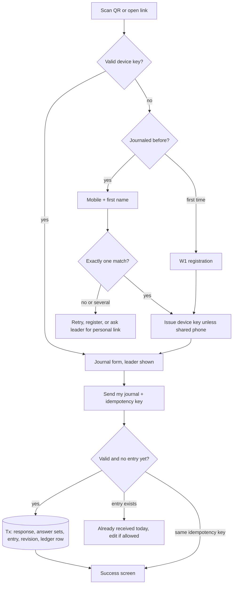

# Phase 5 — Workflows

> Part of the **Ministry System — Product & Architecture Blueprint**. Table and column names refer to [03-database.md](03-database.md); rules (`BR-…`) to [01-product-requirements.md](01-product-requirements.md).
> Every workflow writes `audit_logs` rows for state changes (not repeated in each step). "Tx" = one database transaction.

---

## W1 · New person registration

**Entry paths:** (a) public self-registration, (b) portal "Add person", (c) CSV import (see A7 in Phase 4).

### (a) Public self-registration
| # | Actor | Step | System behaviour |
|---|---|---|---|
| 1 | Participant | Opens `/j` or `/j/{code}` → "This is my first time" | Issues a form session token; leader preselected if a leader code |
| 2 | Participant | Enters first/last name, mobile (optional), leader (search if not preselected), ministry (if required), consent (+ birth year / guardian if minors setting) | Client + server Zod validation; phone → E.164 |
| 3 | System | Abuse checks | Rate limits (IP, device); honeypot/timing; risk flags → Turnstile challenge |
| 4 | System | Duplicate check | **Exact** phone + same normalised first & last name → "Looks like you've journaled with us before" → identify path (W3). **Similar** (same phone/different name = family; similar name under same leader) → allowed, and a `person_duplicate_candidates` row is created |
| 5 | System | **Tx** | Insert `people` (`source='public_registration'`, `registration_status='unconfirmed'`, consent version/time) → `HierarchyService.place` under the chosen leader (node + closure + `leadership_history 'placed'`) → `participant_keys` row (unless "not my phone") → enqueue *"New person registered under you"* to the leader |
| 6 | Participant | Continues straight to the journal form (W2) | Their entry is saved; they are **not yet expected** (BR-J-05) |
| 7 | Leader | Sees "New — please confirm" on Today / Review | **Confirm** → `confirmed`; queues `journal.resync_day` so they count from today. **Not mine** → `leader_change_requests` (`registration_correction`) to the suggested leader or admin queue |
| 8 | System | Unconfirmed after 7 days → reminder to leader; after 30 days → appears in admin *Review* queue | — |

### (b) Portal "Add person"
Leader, Primary Leader or Administrator → form → duplicate check (`DUPLICATE_SUSPECTED` until "This is a different person" is confirmed) → created **confirmed** → optional placement (leaders: automatically under themselves) → optional *Send personal link* (Share sheet / email).

---

## W2 · Daily journal submission (first-time person via general QR)



| # | Step | System behaviour |
|---|---|---|
| 1 | Identify / register | As W1 / W3. Never renders stored data before identification |
| 2 | Load form | Current published `form_versions` + `form_fields`. **Journal date:** now in the ministry timezone. If now < `lateCutoffTime` and yesterday's ledger row for this person is `pending`, show "For yesterday / For today" (BR-J-02) |
| 3 | Fill & send | Client keeps answers in memory/sessionStorage; generates `idempotencyKey` once per attempt series |
| 4 | Validate | Server re-derives the allowed journal dates (never trusts the client); validates each answer against its field (type, required, options, length); accepts a version retired < 12 h ago (E22) |
| 5 | **Tx** | `SELECT … FOR UPDATE` the `journal_days` row (insert it with `is_expected` per rules if absent). If `journal_entry_revisions.idempotency_key` exists → return the original result. If an entry exists → `CONFLICT ALREADY_SUBMITTED`. Else insert `form_responses` → `form_answer_sets` (answers split by each field's sensitivity) → `journal_entries` (`timing` on_time/late, `channel`, `entry_code_id`) → `journal_entry_revisions` #1 → update `journal_days` (`submitted`/`late`, `entry_id`, `review_status='awaiting'` if review expected). If `leaderRef` differs from the current leader → `leader_change_requests` (W7b) |
| 6 | Race safety | A concurrent second submit from another device hits `UNIQUE (person_id, journal_date)` → mapped to `ALREADY_SUBMITTED` |
| 7 | After commit | Invalidate the leader's "Today" cache tag; audit `journal.submitted` (no content); success screen with received time |

---

## W3 · Returning journal submitter

| Situation | Flow | Steps for the person |
|---|---|---|
| **Same phone** (device key) | Open home-screen icon / QR → greeting + form → Send | **2 taps + typing** |
| **New phone, phone-match enabled** | "I've journaled here before" → mobile + first name → one match → key issued → form | +1 short step |
| **Shared phone / several matches** | "Ask your leader for your personal link" → leader: profile → *Issue personal link* → shares via Messenger/Viber/SMS → person opens `/k/{token}` → "Remember this phone for John S.?" → key → form | Leader-assisted, once |
| **Already sent today** | "Your journal for today was received at 7:14 AM ✓". With device key and within edit window: **Edit** → form pre-filled → Send → new `form_responses` + revision N+1; `journal_entries.form_response_id` repointed; `last_submitted_at` updated; timing unchanged | — |
| **Leader appears wrong** | "Not your leader?" → search → pick → the journal is still sent (attributed to the current leader) + change request created (W7b) | — |

---

## W4 · Leader-specific QR journal submission

| # | Step | System behaviour |
|---|---|---|
| 1 | Person scans Mark's QR (`/j/K7M3QX9A`) | Resolve `entry_codes` (active, `journal_leader`); increment scan count. Retired → "This code was replaced" page |
| 2a | Unknown person | Registration with Mark **preselected and locked** (a "Not Mark's group?" link unlocks search) |
| 2b | Known person whose leader **is** Mark | Straight to the form |
| 2c | Known person whose leader is **Anna** | Interstitial: "Your leader is Anna R. This code belongs to Mark S." → **[Keep Anna]** (default) / [Ask to move to Mark] → request (W7b); the journal proceeds either way, attributed to Anna until approved |
| 3 | Submit | As W2; `journal_entries.entry_code_id` records the code (useful to spot leaked codes) |

**Leaked code protection:** unusual registration volume on one code (e.g. > 10/hour) → Turnstile on that code + alert to the leader and admins; the leader rotates the code in one tap (Phase 4, A27 QR codes / A30 My account).

---

## W5 · Journal review

| # | Actor | Step | System behaviour |
|---|---|---|---|
| 1 | Leader | Opens Review queue (or taps a person with "Awaiting") | Keyset query: `journal_days.review_status='awaiting'` in scope, oldest first |
| 2 | Leader | Reads the entry | Policy: `journal.content.view` + depth + BR-J-11; answer sets filtered by sensitivity (hidden-answer count shown). **Access-log** `journal.content_viewed` |
| 3 | Leader | Optional private comment; optional "Flag for follow-up" (with "needs pastoral attention" toggle) | — |
| 4 | Leader | **Mark reviewed & next** | **Tx:** upsert `journal_reviews (entry, reviewer)`; `journal_days.review_status='reviewed'`; if flagged → `care_followups` (`journal_flagged`; visibility `leadership` → assigned to self, or `pastoral` → assigned to the pastoral care pool, with an in-app notice to pastoral staff); `care_status='needs_follow_up'` |
| 5 | System | Entries awaiting > 2 days appear in the leader's *Needs attention*; > 5 days appear for the Primary Leader as a count only ("Mark has 9 journals waiting") | No content is exposed upward |
| 6 | (V1) Leader | "Send a word of encouragement" → `share_with_person` → notification to the person: "Mark left you a note" (content only visible on their device) | — |

---

## W6 · Missing journal monitoring (the daily lifecycle)

```
00:05  journal.open_day(D)        ledger rows for expected people: pending (or excused: rest day / pause)
 …     submissions                pending → submitted
19:00  journal.reminders(D)       opted-in people still pending → reminder (dedupe per person/day)
20:00  journal.leader_digest(D)   leaders: "9 of 12 have journaled; not yet: Peter, Anne, Carlo"
23:59  deadline                   later submissions for D are "late"
00:00–09:00 (D+1)                 late window: person may choose "for yesterday"
09:00  journal.close_day(D)       pending → missed; finalized_at set; streaks computed
```

| # | Step (in `close_day`) | System behaviour |
|---|---|---|
| 1 | Finalise | `UPDATE journal_days SET submission_status='missed', finalized_at=now() WHERE journal_date=D AND submission_status='pending'`; also set `finalized_at` on all other open rows for D |
| 2 | Streaks | For people missed on D, compute consecutive missed expected days (excused days neither break nor extend a streak) |
| 3 | Follow-up suggestion | Streak ≥ `missedStreakThreshold` (3) → `care_followups` (`journal_missed_streak`, assigned to direct leader, `dedupe_key = journal_streak:{person}:{streak_start}`), `care_status='needs_follow_up'` on the day row. The person receives **nothing automatic** beyond opted-in reminders (BR-J-07) |
| 4 | Leader action | Leader calls/messages → resolves with a note ("sick this week") → may add a **retroactive pause**: missed days in range → `excused`, audited |
| 5 | Streak ends | Any received journal closes the open streak follow-up automatically (`resolved`, note "Journal received") unless the leader marked it in progress |
| 6 | Escalation (gentle) | Follow-up open > 7 days → counted in the Primary Leader's *Needs attention* (names visible, no content) |
| 7 | Late submission after close | Public form can't target a closed day. A leader may **proxy-record** (≤ 7 days back, W2 with `channel='proxy'`) → `missed` → `late`, audited |

---

## W7 · Leader reassignment

### (a) Portal move (Administrator, Pastor, or Primary Leader within branch)
| # | Step | System behaviour |
|---|---|---|
| 1 | Profile → *Change leader* (or tree → *Move*) | Dialog: new leader (search, scoped), **with their group** / **leave their group with …**, reason |
| 2 | Validate | Both old and new positions within the actor's scope; `expectedLeaderId` matches (stale check); target not inside the moving sub-tree (cycle); soft warning if the target's group would exceed the size limit |
| 3 | **Tx** under `pg_advisory_xact_lock` | Closure delete/insert; `hierarchy_nodes` parent/depth/primary updated for the sub-tree; `leadership_history` rows sharing one `operation_id`; re-snapshot **unfinalised** `journal_days` (today onward) for the sub-tree; supersede pending change requests for these people; audit |
| 4 | Effects | Journal content access follows BR-J-11 (new leader: from today; previous leader: none). Role scopes anchored on moved leaders move with them automatically (the branch is computed from the closure) |
| 5 | Notify | Old and new leaders (in-app/email); person optionally ("You're now in Mark's group") |

### (b) Request from the public form
`leader_change_requests` (pending, one per person) → receiving leader sees it in *Requests* and on Today → **Approve** → runs (a) as that leader under a system-granted, request-bound permission (audited) · **Reject** with note → requester's leader notified. Unanswered 7 days → admin queue.

### (c) Leader deactivation or archive → W15.

---

## W8 · Devotional scheduling

| # | Actor | Step | System behaviour |
|---|---|---|---|
| 1 | Worship Coordinator | *Setup (once):* serving roles; gathering type "Morning Devotional" (06:00, 60 min) with roster template (Worship Leader ×1, Lead Vocal ×1, Backup Vocal ×2, Keyboard ×1, Guitar ×1, Bass ×0–1, Drums ×0–1, Prayer Leader ×1, Scripture Reader ×1, Devotional Leader ×1, Host ×1, Sound ×1) | `gathering_type_roles` |
| 2 | Coordinator | Teams A/B/C with members and their default serving roles | `teams (team_type='worship')`, `team_memberships`, `team_member_serving_roles` |
| 3 | Coordinator | Schedule: "Mon–Sat 6:00 AM", rotation **weekly** A → B → C, anchor Monday, generate 8 weeks | `gathering_schedules` + `gathering_schedule_teams`; preview of the next 6 occurrences with teams |
| 4 | System | `devotional.generate_gatherings` (nightly and on save) | For each date in the window without a gathering: insert `gatherings` (team by rotation position), **auto-fill roster**: for each template role pick team members whose default roles include it (primary role first), skip unavailable people and people already assigned at an overlapping time, balance by least-recently-served; unfilled required roles flagged. `ON CONFLICT (schedule_id, occurs_on) DO NOTHING`, so **existing gatherings are never overwritten** |
| 5 | Coordinator | Reviews the week; adjusts people; notes; fills flagged gaps (from other teams if needed) | Warnings (overlap, unavailable, not in team) are shown but not blocking |
| 6 | Coordinator | **Publish roster** (per gathering or "publish the whole week") | `roster_published_at`; per assignment: `action_tokens` (purpose `gathering_assignment`, expires at gathering end) + notification (email, or Share buttons in the MVP) |
| 7 | System | `devotional.confirmation_reminders` at T−72 h and T−24 h for `pending` | Dedupe per assignment/offset |
| 8 | Coordinator | Changes after publishing | Replaced/cancelled assignments revoke their tokens and notify the affected members |

---

## W9 · Worship assignment confirmation

| # | Actor | Step | System behaviour |
|---|---|---|---|
| 1 | Member | Opens personal link `/a/{token}` | Token hash lookup → valid, unexpired, not revoked, `use_count < max_uses` → page (P8). Link-preview bots only see the page; the action requires a POST |
| 2 | Member | **I'll be there** | **Tx:** `status='confirmed'`, `responded_at`; audit (actor participant) → dashboard counts update |
| 2′ | Member | **I can't make it** + optional note | `status='declined'`; `care_followups` (`serving_declined`, assigned to the coordinator); coordinator notified with **suggested substitutes** (W14) |
| 3 | Member | Changes mind before the lock time (`response_lock_hours`) | Allowed, audited; after the lock: "Please contact your coordinator" |
| 4 | System | Gathering cancelled | Assignments → `cancelled`; tokens revoked; confirmed members notified |

---

## W10 · Prayer chain creation

| # | Step | System behaviour |
|---|---|---|
| 1 | Coordinator: *New chain* wizard → **Basics:** name, type (continuous / scheduled blocks / event), timezone (default ministry), start/end dates, grace minutes (15), check-in required?, show first names publicly?, owning ministry | Validation: IANA timezone; end ≥ start |
| 2 | **Schedule:** plain-language builder → `rrule` + first slot time + slot length + slots per occurrence + capacity. Examples: 24-hour daily = `FREQ=DAILY`, 00:00, 60 min × 24; Friday night vigil = `FREQ=WEEKLY;BYDAY=FR`, 21:00, 30 min × 18; one-time event = explicit date | Preview shows the next 3 occurrences with local times, including slots that cross midnight |
| 3 | **Report form:** choose the prayer report form (default: Report / Testimony / Prayer request [confidential] / anonymous option) | `report_form_id` |
| 4 | Create (draft) | `prayer_chains` + `prayer_chain_schedules`; an `entry_codes` row (`prayer_chain`) + QR is generated |
| 5 | **Activate** | `status='active'` → `prayer.generate_slots` runs immediately for `generate_days_ahead` days: slots from rrule expanded **in the chain timezone** → `starts_at/ends_at` UTC, `chain_date` = local date of start; `ON CONFLICT (prayer_chain_id, starts_at) DO NOTHING`; exclusion constraint guarantees no overlap |
| 6 | Pause / end | Paused chains generate nothing and send no reminders; existing future assignments stay but are hidden from reminders until resumed |

---

## W11 · Prayer assignment

| Path | Steps | System behaviour |
|---|---|---|
| **Recurring commitment** (primary for 24-h chains) | Coordinator: *Commitments* → person + pattern ("Tuesdays 2:00 AM", from/to) | `prayer_commitments`. Preview lists conflicts (overlapping commitments or assignments). The generation job creates assignments (`source='commitment'`) for matching slots; the exclusion constraint rejects overlaps and they are reported, never silently dropped |
| **Manual** | Chain board → gap → *Assign* → search person (chain pool first: people with previous assignments in this chain) | Checks: slot open and in the future, capacity (`SELECT … FOR UPDATE` on the slot), person overlap (EXCLUDE), unavailability (warning). Insert `prayer_assignments` (`slot_period` copied) + event `assigned` |
| **Links** | After assignment | `action_tokens` (`prayer_assignment`, expires at `ends_at + grace + 24 h`); notification T−24 h with the link; in the MVP the coordinator can also tap **Share** (Messenger/Viber) |
| **Self sign-up** (V1) | Chain page → open slot → take it | Same checks; `source='self_signup'` |

---

## W12 · Prayer confirmation (confirm → check in → complete → report)

**State machine**
```
scheduled ──confirm──► confirmed ──check in──► in_prayer ──complete──► completed
    │                      │                        │                     ▲ (late flag if after end+grace)
    │                      └────────────── complete ─┴─────────────────────┘
    ├──cannot_make_it──► (coordinator substitute) ──► replaced
    └──(end + grace, no completion)──► needs_follow_up ──coordinator──► completed(verified) | missed | excused
                                               └──participant completes late──► completed (completed_late)
```

| # | Actor | Step | System behaviour |
|---|---|---|---|
| 1 | System | T−24 h reminder with link (or the person opens the chain QR) | `prayer.slot_reminders`, dedupe per assignment |
| 2 | Participant | **Confirm** (any time before start) | `confirmed`, `confirmed_at`; event |
| 3 | System | T−30 min "Your prayer slot starts at 2:00 AM" | Quiet hours do **not** apply to a person's own slot reminders if they opted in |
| 4 | Participant | **I'm praying now** (from start − 15 min to end) | `in_prayer`, `checked_in_at`; chain page shows "Now praying: Mary" if allowed |
| 5 | Participant | **I've finished praying** (start → end + grace) | `completed`, `completed_at`; if after end + grace → `completed_late = true` |
| 6 | Participant | Optional report / testimony / prayer request, optional anonymous | `form_responses` (`is_anonymous`) + answer sets by sensitivity; `report_response_id` |
| 7 | (V1) System | "Pass the baton": notify the next slot's person that the previous slot completed | — |

---

## W13 · Missed prayer slot

| # | Step | System behaviour |
|---|---|---|
| 1 | `prayer.check_overdue` (every 5 min) | Finds open slots with `ends_at + grace_minutes < now()` and assignments in `scheduled`/`confirmed`/`in_prayer` |
| 2 | Flag | → `needs_follow_up` + event `flagged_follow_up`; `care_followups` (`prayer_unconfirmed`, assigned to the chain coordinator, dedupe per assignment). Checked-in-but-not-completed assignments are flagged with a lower priority ("checked in, didn't mark finished") and can be bulk-resolved |
| 3 | Notify coordinator | In-app immediately; email/SMS respects quiet hours → included in the morning digest ("1 slot needs follow-up: 2–3 AM, Peter") |
| 4 | Coordinator | Contacts the person with care, then resolves: **Completed (verified)** ("prayed, forgot to tap"), **Missed**, or **Excused** (emergency, illness) with a note | `resolved_by/at` (CHECK: missed/excused require a human resolver); follow-up resolved |
| 5 | Participant taps late | Before resolution: → `completed`, `completed_late`, follow-up auto-resolved |
| 6 | Reporting | Reports separate **Completed**, **Completed late**, **Unconfirmed (awaiting review)**, **Missed (reviewed)**, **Excused**. Nothing counts as missed without a human decision (BR-PR-04) |

---

## W14 · Substitute assignment

### Prayer
| # | Step | System behaviour |
|---|---|---|
| 1 | Trigger | Participant "I can't make it" (reason) **or** coordinator initiates from the board |
| 2 | Suggestions | Candidates: chain pool (previous participants of this chain) + opted-in prayer team members; exclude people with overlapping assignments or unavailability; rank by fewest assignments in the last 30 days, then by same weekday/time history |
| 3 | Assign | **Tx:** new assignment (`source='substitute'`, `substitute_for_id = original`) → original `replaced` (if before start; no negative mark) → original's tokens revoked → substitute token + notification → events on both |
| 4 | After start | If the replacement happens after the slot started, the original goes through W13 resolution (usually **Excused**); the substitute is added for the slot (the exclusion constraint allows it because it is a different person) |

### Worship / devotional
| # | Step | System behaviour |
|---|---|---|
| 1 | Trigger | Member declines (W9), is marked unavailable, or the coordinator replaces them |
| 2 | Suggestions | Same serving role as a default role → team members first, then other worship teams; exclude unavailable and people already serving that gathering or an overlapping one; rank by least recently served in that role |
| 3 | Assign | **Tx:** new `gathering_assignments` (`source='substitute'`, `substitute_for_id`), original → `replaced`, tokens handled as above, notification to the substitute (and the original, if the coordinator initiated it) |
| 4 | Unfilled at T−24 h | Dashboard *Needs attention* shows "Keyboard for tomorrow is unfilled" to the Worship Coordinator |

---

## W15 · Leader deactivation (supporting workflow)

1. Admin sets a leader inactive or archives them → the system detects a direct group → **wizard** (BR-H-04):
   - *Reassign all to:* one leader (search)
   - *Reassign individually:* table of people → leader per row
   - *Temporarily move to their own leader:* the direct group goes to the deactivated leader's leader, and a follow-up is created for the Primary Leader to find a permanent leader
2. **Tx:** W7a for each move (one `operation_id`), then the status change; the user account (if any) is deactivated and sessions revoked; the leader's entry code is retired; their role assignments are revoked.
3. Deceased: same flow; archive reason `deceased`; all notifications to that person suppressed immediately; UI copy is respectful ("In memory" label on history views).

## W16 · Duplicate merge (supporting workflow, V1 UI)

1. Candidate pair reviewed side by side → choose the survivor, then per field pick the value to keep.
2. **Tx:** re-point all references (ledger/entries: if both have an entry on the same date, keep both entries and flag the conflict for manual choice before the merge is allowed); merged person archived (`duplicate`, `merged_into_person_id`); `person_merges.merged_snapshot` stored; hierarchy: merged node's group moved to the survivor; device keys of both are kept, pointing to the survivor.
3. Audit + notification to affected leaders.
